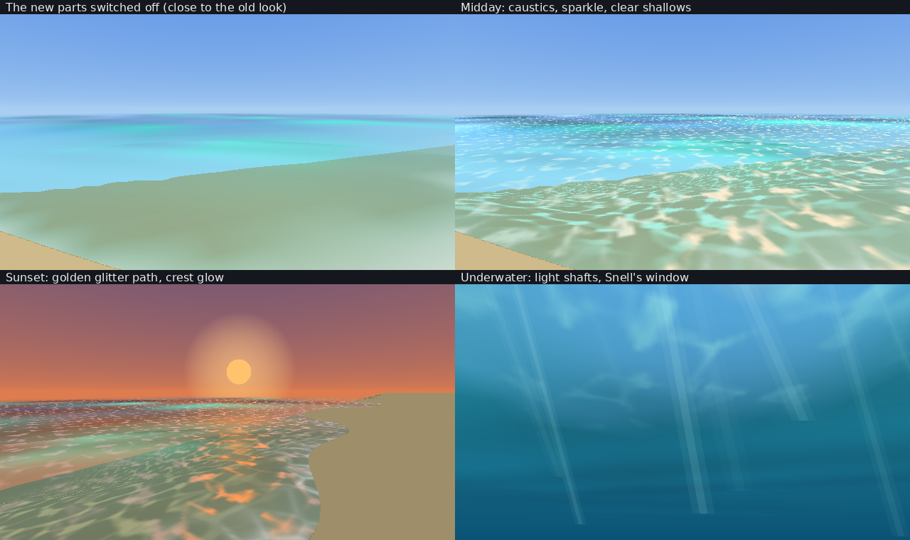

# Water

Everything about the water lives in three places:

- `shared/water_sim.h`: the swell (six Gerstner waves: sharp crests, wide troughs), the ripple simulation (`RippleField`, the wave equation on a
  64 x 64 grid of 14-unit cells that follows the player), and the textures (caustics and glints as 32-frame looping flipbooks, foam), made at
  start-up on a thread of their own. Tested in `server/tests/water_tests.cpp`.
- `shared/water_look.h`: how a point of the surface is shaded (colour by depth, Fresnel sky reflection, sun and moon glitter path, light through
  the crests, Snell's window from below, foam). The game and the preview renderer use this same function.
- `mod/Royale/RoyaleMod.cpp`, section "water": drawing it in the Water graphics layer.

`tools/water/preview.cpp` renders the pictures above from the same code: `g++ -O2 -std=c++17 -Ishared tools/water/preview.cpp -o /tmp/wp && /tmp/wp docs/water`
(then convert the .ppm files). It shades the game's grid points and blends between them as the game does, over a plain sandy floor; it is a
preview, not a screenshot.

## What is drawn

All water surfaces get it: the island maps' sea and lakes (Hyrule Kingdom's water at -227 included), the game's own lakes and rivers on other
maps (with a smaller swell, since the game's own water sits just under ours), and puddles (the sky sheen and the sparkle, as a soft oval on each).

1. **Caustics**: a sheet lying on the floor under shallow water (its own 40-unit grid round the camera), drawn first, with the caustics
   flipbook. Bright in the shallows in sun, fading with depth, at night and under cloud. On the old Fortnite island it lies on the drawn sea bed.
2. **The water**: the grid that follows the camera (coarse squares, and fine 8 x 8 squares round the player and wherever someone is in the water).
   Vertex colour and alpha from `ShadeWater`.
3. **Sparkle**: the same points again with the glint flipbook; the vertex colour is the sky's (or the sun's on the glitter path) and the vertex
   alpha says how much shows.
4. **Foam**: the same points with the foam texture, on the waterline, in wakes and on crests about to break.

Texture passes use the combiner `colour = SHADE, alpha = TEXEL0 x SHADE alpha` with 64 x 64 I8 textures. Texture coordinates count from an
origin that moves a whole tile at a time, so they stay inside the 16-bit range and never jump.

## Graphics page, Water section

Swell height, wave shape (round to choppy), surface detail, clear water, sparkle (on/off and strength), caustics (on/off and brightness), textured
foam (on/off and amount), ripple simulation, the game's splashes and more water life, displacement, rain rings, sky and body reflections,
underwater look (on/off and strength), current. CVars `Royale.Water*`.

## For creatures and water physics

- `WaterInfoAt(x, z)` gives what the water is like at a point as it is drawn: surface level, height now (swell and ripples), depth, normal, current.
- `AddWaterDisturb(x, z, strength, size)` makes a ring (inside the ripple simulation it pushes the simulation; further off it is an analytic ring).
- `gRipples.Impulse(x, z, depth, radius)` pushes the simulation directly, every frame if something keeps moving (a fin, a tail): it makes a wake.
- `royale::water::Swell(x, z, t, amp, chop)` is the open-water wave itself (height, sideways shift, normal, how near the crest is to breaking).
