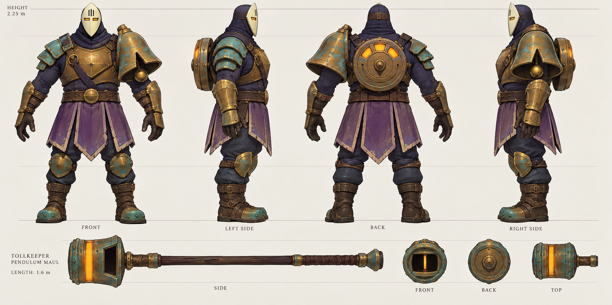

# Morrow, the Hollowbell Warden
Astra design handoff • 8 October 2026 • implementation target: existing OoT Battle Royale

## Character and encounter promise

A masked male bell keeper who charges a toll in stolen seconds. He believes his broken clock can hold the storm outside his village if he gathers enough time. His broad bronze bell shoulder, slim ivory mask and three amber clock windows make him readable across a crowded fight. Fighting him means recognizing the chime, leaving the marked ground, and punishing his exhausted recovery.

This is an original character. The requested blend is expressed through colorful, chunky battle royale silhouettes and contested loot, ancient-adventure equipment and readable attack tells, and eerie masks, repeating time and a sympathetic obsession. His invented story belongs to this project's crossover setting; it is not a claim about any franchise's canon.

Personality: excessively polite, possessive, dryly funny. He carefully straightens his tabard before fighting, counts tolls on three fingers, and apologizes to his bell when struck. He tries to save a village that no longer exists. No dialogue is required to recognize this: idle counts, a formal challenge bow, furious clock winding below half health, and a final relieved exhale tell the story.

Optional short text: challenge "One moment. That is all I ask."; special "Your time is due."; phase change "No. We can still make it."; defeat "Let them… have tomorrow." Use text subtitles if voice is unavailable. Combat cues must remain nonverbal and distinct.

## Visual authority and model dimensions

The turnaround is visual authority for silhouette, colors and materials. Written dimensions and anatomical placement below resolve perspective or label ambiguity. The four sheet figures are FRONT, profile looking screen-right, BACK, profile looking screen-left. The second figure exposes his anatomical RIGHT shoulder; the fourth exposes his anatomical LEFT bell shoulder. Do not mirror the bell to match the image's informal side labels.

| Part | Build target |
|---|---|
| Height | 2.25 m including mask crown, feet on Z=0; six to six-and-a-half heads |
| Shoulder span | 1.30 m including bell; body depth 0.52 m |
| Head | Mask 0.37 m high, 0.22 m wide, 0.08 m forward depth; closed back padded cowl |
| Left bell | 0.48 m high, 0.43 m mouth diameter; opening down; front V notch; one separate clapper |
| Right armor | Three overlapping plates; visibly lower and smaller than bell |
| Clock spool | 0.45 m diameter, 0.14 m thickness, centered upper back; THREE amber windows |
| Tabard | Four broad pointed panels to just above knee; front/rear center split |
| Weapon | 1.60 m overall; drum head 0.44 m long × 0.38 m diameter, rectangular opening |
| Stance | A-pose, feet 0.44 m apart; maul separately authored, right-hand socket |

Blender coordinates: Z up, face -Y, +X is character's anatomical left in front view. Export existing convention (x, y, z) -> (x, z, -y), then 100 game units per metre. Author at final size; use boss scale 1.0 to avoid double scaling. The existing generic boss reach/body radius is a gameplay envelope, not the mesh's measured dimensions.

Palette: ivory #E6D8B7; bronze #A5743D; patina #3E8E88; indigo #252640; violet #705178; amber #FFBA57; leather #493327. Amber appears only at eyes, spool windows, and maul insert. Mask has two horizontal eye slits, three brow grooves, no mouth. No cape, horns, oversized spikes or extra floating ornaments.

Top construction: bell is an elliptical shell over LEFT upper arm, cowl centered, rear spool sits behind chest. Underside: dark bell cavity plus clapper, solid soles, tabard interior dark violet. Use the prop detail for maul end shape; keep its rectangular hole readable at mid distance.

## Initial balance

All values are tunable starting values, not playtest findings. Damage below is raw hearts BEFORE shared kBossDamageScale (currently 0.75) and the normal defense pipeline. Preserve that pipeline and avoid applying the scale twice.

| Property | Initial value |
|---|---|
| BossKind | Append Hollowbell after existing kinds; never renumber existing IDs |
| Name / title | Morrow / The Hollowbell Warden |
| HP | 30 hearts |
| Normal hit | 1.0 raw heart (0.75 before player defenses) |
| Speed | 60 game units/sec; 72 below 50% HP |
| Basic attack cycle | 1.9 seconds; 1.65 below 50% HP |
| Specials | Alternate Toll Road and Third Toll; 7 seconds after completing recovery |
| Aggro / leash | Existing 450 / 1100 units; server owns target selection |
| Traversal | Leap only as navigation support; no damaging teleport |
| Defeat reward | 4 existing Epic/Legendary chest drops using current KillBoss logic |
| Population | At most one Morrow per match when selected, within existing 8 boss limit |

Use current nearest-target retention and all-player attack tests, so other squads can contest and are never excluded from damage. No player time freeze, stolen inventory, forced emote, camera effect, or global storm modification. "Borrowed time" is personality and attack rhythm.

Recommended location: an open ruined bell court with two routes around it and at least 500 units of traversable escape space. Enable in the existing normal miniboss selection pool; a fixed new map landmark is optional follow-up, not required to make him playable. Keep original authored POI assignments intact unless deliberately adding a site.

## Attacks, exact tells and counters

### 1. Pendulum Sweep — close punish

Use existing basic boss windup/hit pipeline with a Morrow-specific 0.85 sec windup if feasible (generic 0.7 sec is the minimum acceptable fallback). He brings the maul visibly across his right shoulder; eyes flash once; short metal intake cue. Feet and facing lock during windup. At impact deal 1.0 raw heart in the existing forward cone/range, once per target. Recovery until attack cooldown permits the next attack. Counter: step or roll behind him, retreat from reach, or use the current shield/defense behavior. No extra stun.

Animation timeline: 0–0.65 raise/twist; 0.65–0.85 accelerate; 0.85 impact; 0.85–1.25 follow-through; 1.25–1.9 reset. Never retarget the cone after its windup starts.

### 2. Toll Road — three linear ground blows

Trigger when target is 160–650 units away; if too close choose Third Toll instead. Snap facing once to current target. Plant maul; trace THREE persistent circular warnings along that heading. Centers at 150, 300, 450 units from cast origin; radius 85; resolve at 1.10, 1.50, 1.90 sec. Raw damage 1.1 each. Use StrikeStyle::Rock to preserve ordinary damage without freeze. Neighbor circles slightly overlap; movement sideways is the intended counter. Avoid invalid or blocked strike positions rather than placing them through solid walls.

Set Slam mode, aux 1, cast duration 2.0 sec; then Stunned 1.6 sec. Players can circle behind and attack during this opening. Existing BossDazed damage multiplier 1.25 applies to the whole boss; rear spool glow explains vulnerability. Do not require unimplemented per-limb hitboxes. At most one hit per individual strike; a player deliberately remaining on multiple resolved circles can take multiple hits.

### 3. Third Toll — three remembered positions

Used on the next special, alternating with Toll Road. At cast start freeze target position P and direction U from boss to P; perpendicular V. Place warnings at P and P ± 170V, each radius 75. Resolve left at 1.20 sec, right at 1.70 sec, center at 2.20 sec. Damage 0.8 raw each, StrikeStyle::Rock. The target can step forward/backward; circles never follow a moving player. If circles fail ground/walkability checks, skip invalid circles. Pose: lift bell shoulder, tap maul shaft, three distinct chimes; the three rear windows extinguish one at a time.

Set Summon mode, aux 2, cast duration 2.3 sec; then Stunned 1.8 sec. Aim belongs to the server; render warnings from existing Strike events, never independently estimate target positions. Counter: keep moving beyond the marked triad, then punish the long recovery. At distances below 160, center triad around boss position + forward×160 to leave some close escape space.

### 4. Overtime — one health phase, no new unfair attack

At HP <= 50%, rear windows brighten and the bell cracks visually with a 0.8 sec non-damaging clock-winding flourish if this can be made cancel-safe. Increase walk speed and shorten basic cooldown to values above. Keep all warning durations, radii, damage and special recovery unchanged. Third Toll's order becomes center, left, right at the SAME three delays; set aux 3 so presentation is explicit. The same move stays readable, but players must watch the order. A phase transition never interrupts an already scheduled attack, adds hidden damage, or heals him. Simplest first implementation may show the phase immediately via HP and defer the flourish.

## Selection and cancellation rules

Idle -> acquire -> chase -> basic attack or special -> recovery -> chase. Alternate specials deterministically using a per-boss counter. If a move cannot run, chase; do not repeatedly increment the counter on failed selection. Leave at least 1.5 sec after first aggro before special selection.

When defeated, cancel this boss's pending strike damage and matching visual warnings. Once scheduled, ordinary hits do not interrupt special telegraphs in version one: retain existing heavy-hit interruption only for the basic windup. This prevents orphaned delayed hits and misleading interrupted poses. Leash return cancels pending owned strikes and clears attack state. Do not reset HP immediately on a brief target switch; use existing return behavior. Any new cancel path must be tested.

No persistent arena wall and no ranged damage immunity. He is optional risk/reward while the storm continues. Existing loot is public and boss-kill score follows current credit rules. Do not promise a custom Mythic reward without implementing inventory, icon, networking, and balance separately.

## Animation and asset delivery

Target 2,500–4,000 triangles, hard ceiling 5,000; LOD optional if renderer supports it. Prefer one 128×128 or 256×256 painted atlas (or small material tiles compatible with existing exporter), opaque material and separate simple emissive accents. No realtime cloth or simulated chain. At most 24 bones, maximum two influences/vertex if following Bokoblin exporter. Separate clapper and maul rigid attachment bones; cloth gets broad panel bones.

Required clips at 20 FPS: idle_count (2.4s loop), walk (0.9s loop), alert_bow (0.8s), sweep (1.9s), toll_road (2.0s), third_toll (2.3s), recover (1.8s), hurt (0.3s additive or recoil), defeated (2.0s). Root movement comes from server; no authored locomotion translation. Death: kneel, release maul, windows dim, bow head; no ragdoll required.

Deliver editable .blend, portable .glb with clips, texture PNG(s), reproducible build/export Python, generated shared model header, front/back/left/right preview renders and export report. Authoring source is authoritative; never hand-edit generated arrays.

## Original sound cue production request for Sol

Create actual original WAV files with a deterministic synthesis script; no franchise recordings. Mono PCM16, 44.1kHz, peak <= -1dBFS, short attack/release fades, no silence padding. Keep repeated cues modest; warnings audible through combat without replacing visual warnings.

| File/cue | Length | Synthesis character / trigger |
|---|---|---|
| morrow_aggro.wav | 1.0s | Low bronze bell: inharmonic partials 220, 581, 1012Hz; soft gear tick; once on acquisition |
| morrow_sweep.wav | 0.6s | Filtered noise whoosh falling to a metallic click; during sweep windup |
| morrow_impact.wav | 0.5s | 90Hz body thump + short noisy bronze rattle; at landed swing/strike |
| morrow_toll.wav | 0.7s | Clear 440Hz bell plus 1.52x/2.13x partials; one per telegraphed toll, pitch steps optional |
| morrow_exposed.wav | 0.8s | Descending spring twang and dry clock click; recovery entry |
| morrow_defeat.wav | 1.8s | Three bell notes descending, filtered wind exhale; once on defeat |

Original synthesis is an acceptable final asset, not a placeholder requiring purchased sounds. Include provenance/license note and a playable preview playlist. Integrate with the project's verified sound pipeline where supported; clearly distinguish created files from runtime-connected cues. Do not substitute existing ROM sounds while claiming these custom sounds are connected.

## Verified repository integration map

Checked clean branch codex/playtest-menu-gameplay-fixes in mod-feature-split-worktree on 8 October 2026.

- shared/boss.h: append kind, kMiniBossKinds and definition. Current kinds end at ChuDark, 17 total; IDs must remain stable. Keep IsChuKind and IsDragonKind ranges unchanged.
- server/match.h: SpawnBosses, StartMiniSpecial, TickMini, TickMiniMove, AddStrike, AttackBoss, KillBoss. Use dedicated helper functions for Morrow where clearer; server remains authoritative.
- shared/balance.h: kBossDamageScale currently 0.75.
- shared/protocol.h: BossNet already sends kind, mode, aux, hp; no timing field. Existing strike events carry warning timing/geometry. Current protocol version 34; appending a kind changes peer compatibility even if layout stays the same, so versioning must be evaluated and normally bumped together with peer tests.
- mod/Royale/RoyaleBosses.h: actor creation, update, draw, snapshots and effects. Current existing bosses mostly use ROM actor assets; a genuinely new custom character needs a custom draw branch and must not silently resolve to an existing boss actor.
- tools/bokoblin/build_bokoblin.py, export_bokoblin.py; mod/Royale/RoyaleBokoblins.h: concrete custom mesh/rig pipeline reference, 32-vertex batches, max two bone influences, Blender-to-game conversion.
- mod/Royale/FEATURES.md and WorldObjects.inc: preserve include ordering; generated arrays need source authoring and reproducibility.

Suggested code organization: shared/hollowbell.h for constants if helpful; tools/bosses/build_morrow.py and export; assets/bosses/morrow; focused custom rendering header included by RoyaleBosses.h. Sol may adapt structure to actual integration rather than force these exact filenames.

## Completion and checks

Design and turnaround are complete; code, model, sounds, device verification belong to Sol handoff.

Required implementation checks: appended IDs/serialization bounds, deterministic attack selection, actual telegraph-to-hit timings, frozen strike centers, phase threshold without duplicate triggers, defense scale only once, all-player damage, death/leash cancellation, rewards once, valid mesh bounds/finite vertices/triangle budget and export determinism. Run relevant server/net tests, layout checker, and engine compile check for renderer edits. Device checks must cover readable tell at handheld size, cover/terrain behavior, third-party players, audio timing, and performance. A passing build is not an Odin playtest.

Generation: built-in image_gen, prompt saved at assets/bosses/morrow/IMAGE-PROMPT.txt. Turnaround inspected: four complete views, correct physical asymmetric armor, back spool and prop details present. Informal profile labels are resolved explicitly above.

